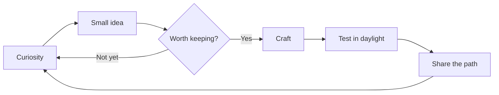

<div align="center">


### 🧝‍♂️ Keeper of the Code Forest


[](https://github.com/ElfTheCoder)
[](#)
[](#)

</div>

---

## 🌲 About the Elf

I wander through the code forest, building thoughtful tools and learning something new with every trail.

- 🔭 Exploring: **creative software and practical automation**
- 🌱 Learning: **clean architecture, friendly interfaces, and better tests**
- 💬 Ask me about: **JavaScript, Python, and turning rough ideas into working code**
- ⚡ Motto: **small steps, sturdy bridges**

## 🧭 Quest Board

| Quest | Status | Reward |
| --- | --- | --- |
| Build something useful | 🟢 In progress | A tool someone enjoys using |
| Learn a sharper pattern | 🟡 Always open | One less tangled path |
| Leave better notes | 🟢 Active | A kinder forest for future travelers |
| Find a thoughtful collaborator | 🔵 Seeking | Shared mischief, clean commits |

## ✨ Spellbook

| Incantation | Purpose |
| --- | --- |
| `listen()` | Understand the problem before touching the code |
| `craft()` | Make the smallest useful thing |
| `test()` | Check the spell in daylight |
| `share()` | Leave the path clearer for the next traveler |

## 🗺️ Map of the Forest



## 🧰 Tools of the Trade

<div align="center">


</div>

## 🗺️ Current Trail

```text
forest/elfthecoder
├── curiosity        ████████████████████ 100%
├── experimentation ████████████████░░░░  80%
├── documentation    ██████████████░░░░░░  70%
└── coffee           █████████████████░░░  85%
```

<details>
<summary>🌙 A note from the lantern room</summary>

> The best code feels like a well-marked forest path: calm to follow, easy to return to, and kind to whoever comes next.

</details>

<div align="center">


</div>
